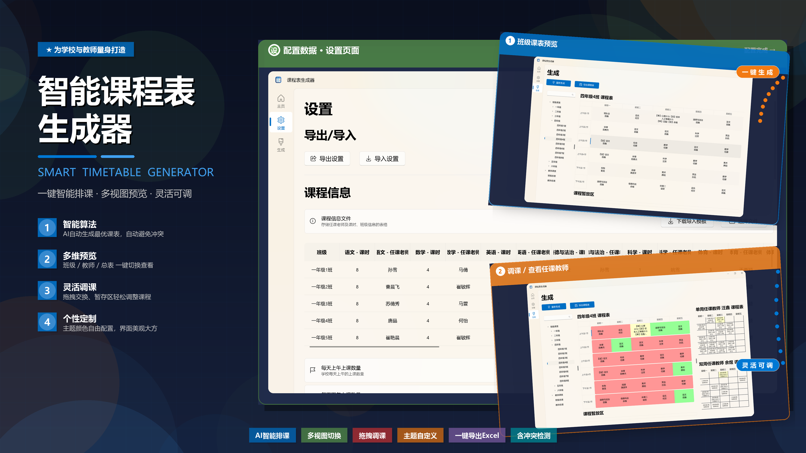
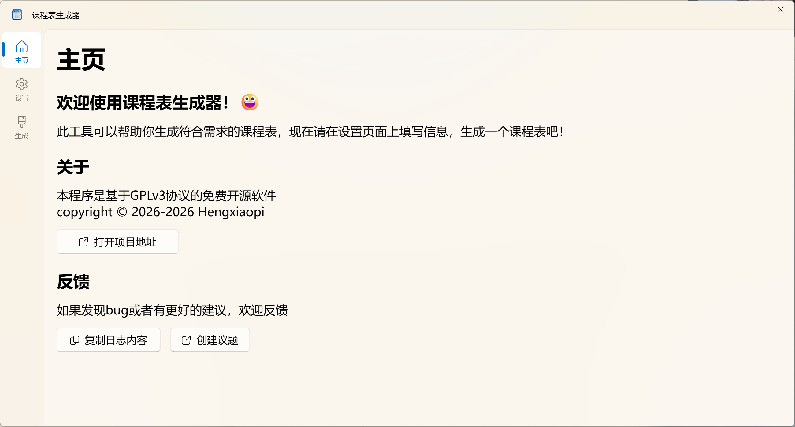
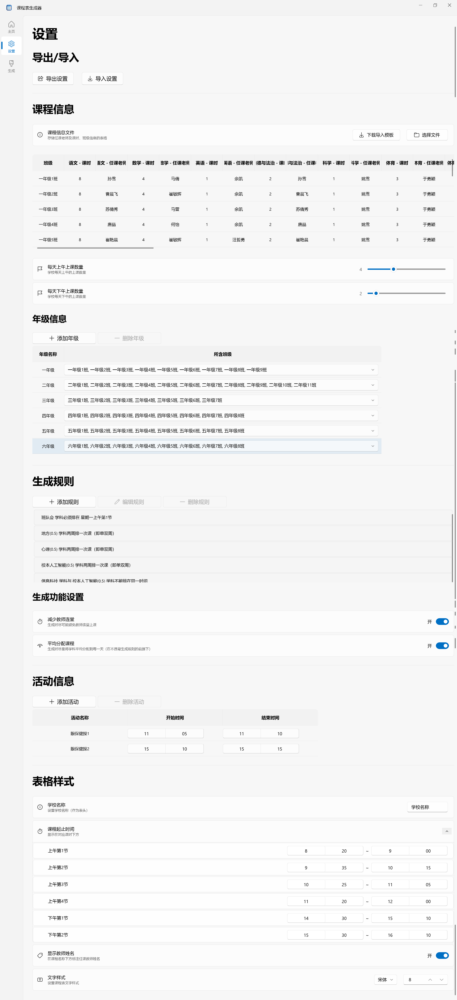
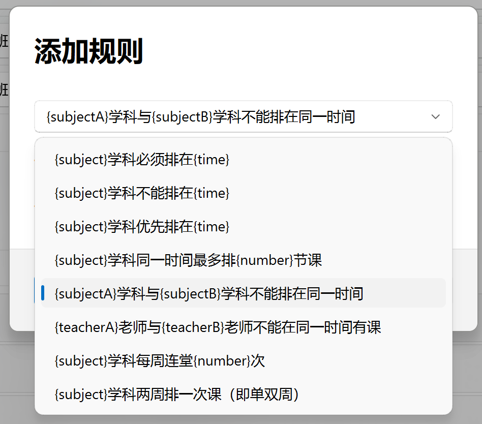
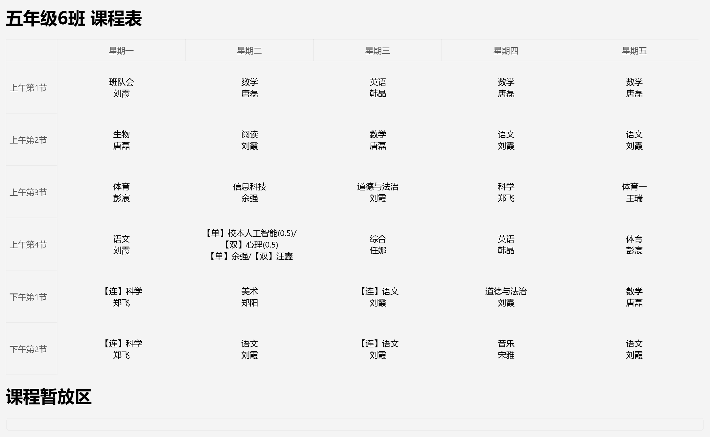
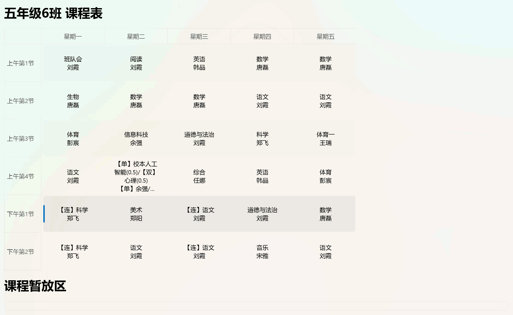
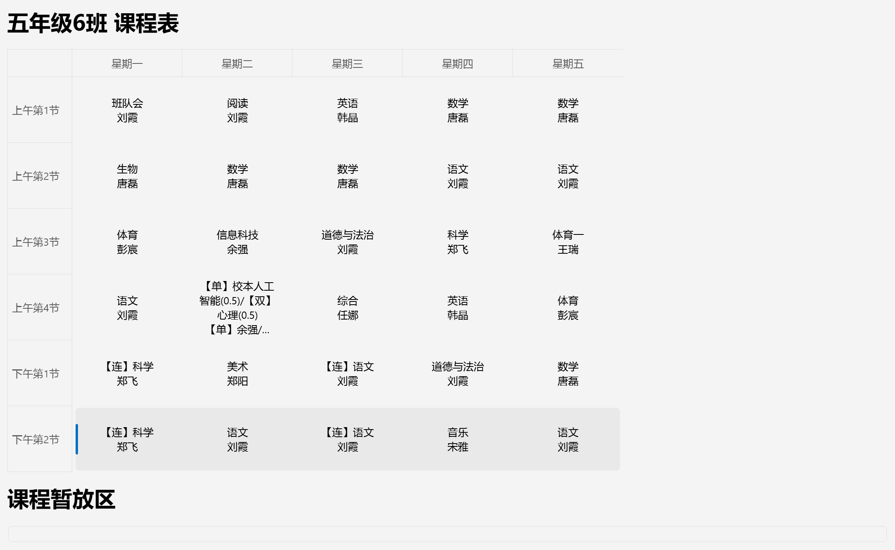
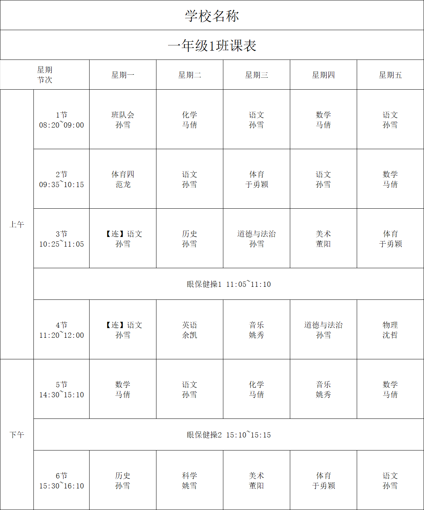
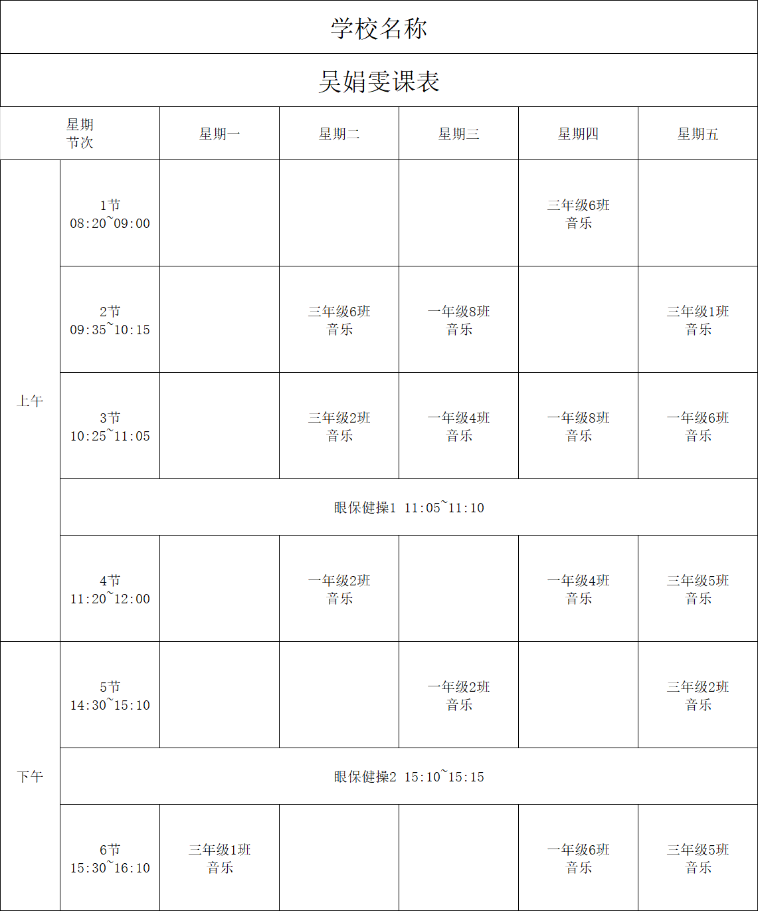
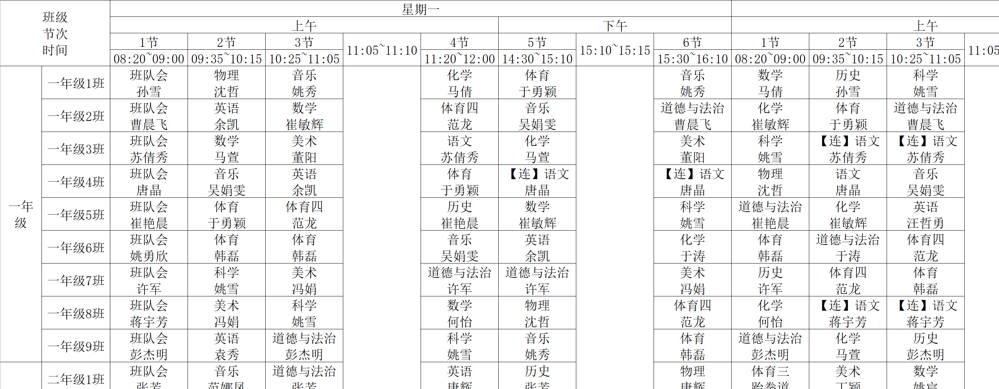

  

<h1 align="center">课程表生成器</h1>

  一个可以帮助学校生成符合需求的课程表的小工具

## 项目介绍
这是一个排课工具，可以帮助学校老师轻松生成全校班级和教师的课程安排表。
## 主要亮点
- 界面简洁易上手，几乎无学习成本
- 课程表生成规则支持自定义
- 功能人性化，如减少教师连堂、平均分配课程等

## 支持的功能

△点击播放演示视频
### 设置选项

- 导出、导入设置
- 导入课程信息表（可下载表格模板）
- 调整上下午课程数量
- 设置年级信息

- 自定义生成规则：必须排、不能排、优先排、同时最多排、不能同时排、老师不能同时排、连堂、单双周
- 减少教师连堂
- 平均分配课程
- 设置活动名称、时间
- 设置学校名称
- 设置课程起止时间
- 设置是否显示教师姓名
- 设置导出后的文字字体、字号
### 生成后手动调整

- 表格内拖拽可交换
- 点击课程时或拖拽过程中可用不同颜色显示能否交换，并在右侧同步显示任课教师的课程表便于对照

- 可将课程拖拽至暂存区暂放（左侧会有小红点提醒未排完）

- 单双周课程可以通过拖拽合并、拆分
### 调整后直接导出为excel
最终可直接导出以下四份表格（信息为示例，点击图片可跳转至excel文件）：
- 班级课表（按年段整理）

- 教师课表（按年段整理）

- 班级总表（全校的班级汇总课表）

- 教师总表（全校的教师汇总课表）

## 使用方法（二选一）
### 一、自行搭建运行环境
1. 前往[Python官网](https://python.org/downloads)下载并安装Python3.9+版本
2. 将本项目下载解压到本地
3. 在项目根目录运行`pip install -r requirements.txt`（报错可搜索`pip换源`）
4. 双击`main.py`或运行`python main.py`即可启动
### 二、使用[Releases](https://github.com/hengdapi/School-Timetable-Generator/releases)中的安装包
- 选择对应版本的安装包（后缀为`Setup.exe`），双击安装即可
- 下载压缩包（`.zip`格式）解压到任意位置，双击运行`main.exe`
## 许可证
根据 GPL v3.0 许可证分发。打开 [`LICENSE`](LICENSE) 查看更多内容。

Copyright © 2026 Hengxiaopi.
## 致谢
本项目使用了以下开源项目：
- [QFluentWidgets](https://github.com/zhiyiYo/PyQt-Fluent-Widgets)
- [PySide6-Fluent-Widgets-Pro](https://github.com/Fairy-Oracle-Sanctuary/PySide6-Fluent-Widgets-Pro)

感谢以下贡献者：

特别感谢[buBailai](https://github.com/buBailai)为本项目的开发提供宝贵数据和建议